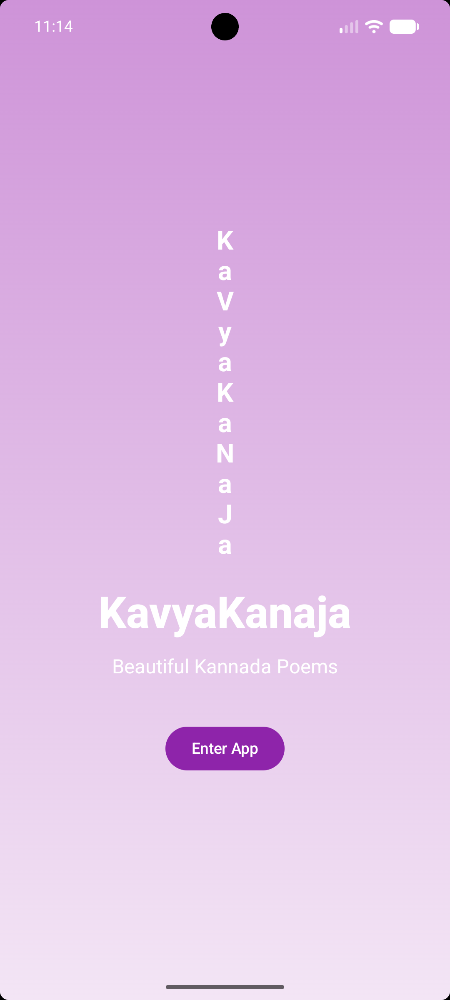
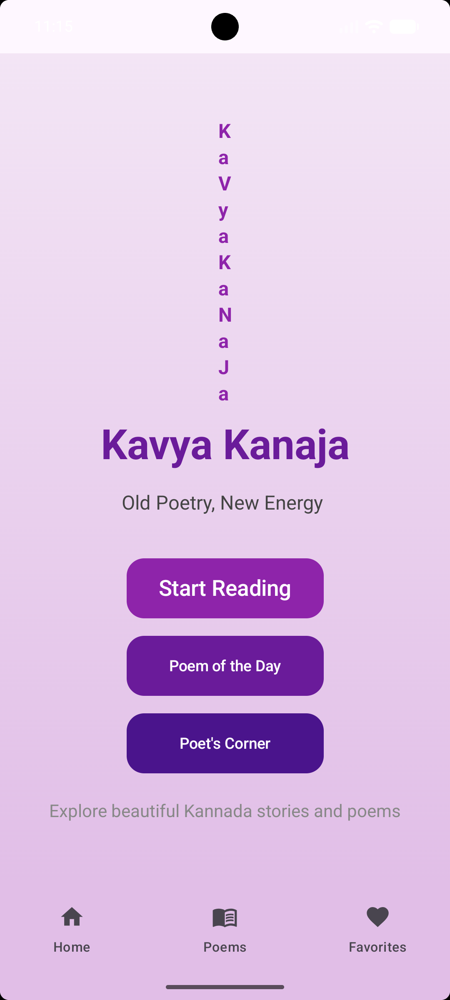
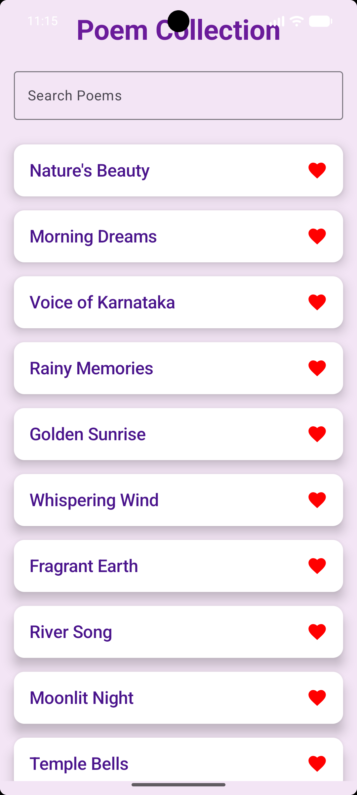
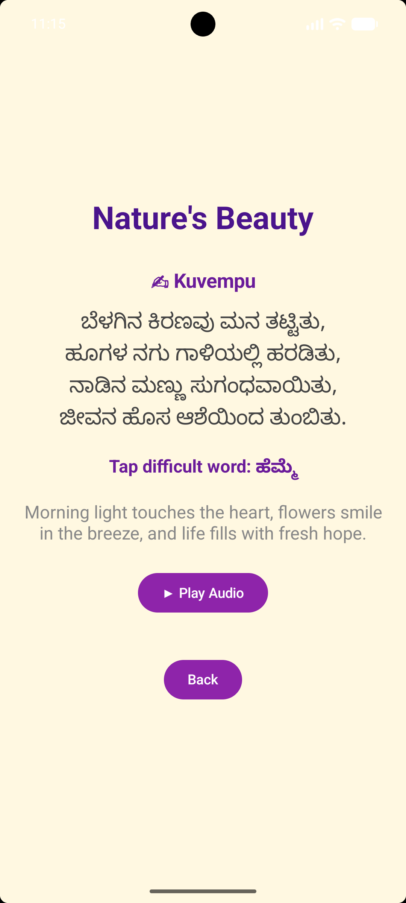

# Kavya Kanaja

Kavya Kanaja is an Android application developed using Kotlin and Jetpack Compose to revive Kannada poetry for Gen Z learners. The app provides a collection of 50+ Kannada poems with English meanings, audio recitation, word meaning popups, and biographies of famous Kannada poets.

## Problem Statement
Many students find classical Kannada poetry difficult to understand because of complex vocabulary and lack of interactive learning tools. Kavya Kanaja makes poetry accessible through translations, audio, and explanations.

## Features
- Splash Screen
- Home Screen
- Searchable Poem Collection
- Full Poem View
- English Meaning
- Audio Playback
- Word Meaning Popup
- Poem of the Day
- Poet's Corner with biographies

## Tech Stack
- Kotlin
- Jetpack Compose
- Navigation Compose
- Gson
- MediaPlayer

## Project Structure
- `MainActivity.kt`
- `poems.json`
- `res/raw/`
- `build.gradle.kts`

## How to Run
1. Clone the repository.
2. Open in Android Studio.
3. Sync Gradle.
4. Run on an emulator or Android device.

## GitHub Repository
https://github.com/2023-Reshma/KavyaKanaja-App

## Future Enhancements
- Favorite poems
- Share poem
- Text-to-speech
- Dark mode
- ## Screenshots

### Splash Screen

### Home Screen

### Poem Collection

### Full Poem Screen

### Poet's Corner

